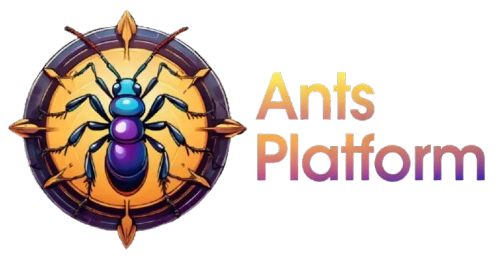

<div align="center">
   
</div>

# Ants Platform Python SDK

[](https://opensource.org/licenses/MIT)
[](https://pypi.python.org/pypi/ants-platform)

## Installation

> [!IMPORTANT]
> This is the Ants Platform Python SDK, a custom observability platform built on top of modern LLM infrastructure.

```
pip install ants-platform
```

## Docs

Please see our [docs](https://agenticants.ai/docs) for detailed information on this SDK.
